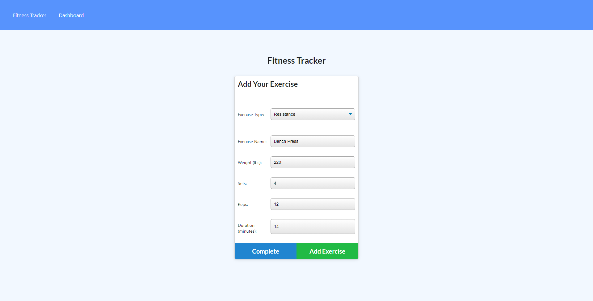
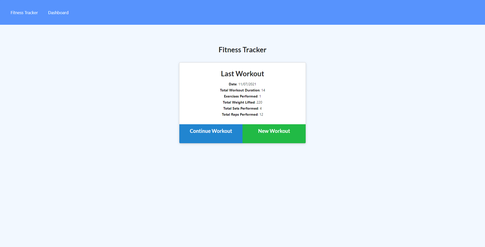

# Workout-Tracker

[](https://opensource.org/licenses/MIT)
[](https://nodejs.org/en/docs/)
[](https://expressjs.com/)
[](https://www.mongodb.com/)
[](https://mongoosejs.com/)
[](https://www.javascript.com/)
[](https://developer.mozilla.org/en-US/docs/Glossary/HTML5)
[](https://developer.mozilla.org/en-US/docs/Web/CSS)

## Description

An application where you can view, create and track daily workouts. 

You can log multiple exercises in a workout on a given day. Tha application allows you to track the name, type, weight, sets, reps, and duration of exercise

The application uses the Mongo database with a Mongoose schema and handles routes with Express.

## 📖Table of Contents
1. [Installation](#installation)
2. [Usage](#usage)
3. [Assets](#assets)
4. [Technologies](#Technologies)
5. [License](#license)
6. [Contributing](#contributing)
7. [Tests](#tests)
8. [Questions](#questions)

## Installation
1. To install this application clone it through GitHub using the following code in the terminal: 
    ``` 
    git clone https://github.com/TrushilBudhia/Workout-Tracker.git
    ```
2. To add the dependencies to the application, navigate to the root directory for the application and run:
    ```js
    npm install
    ```
    
## Usage
Navigate to the root directory for the application and run the following code in the terminal to start the application:
```js
npm start
```

## Assets
Live demo of the application hosted on Heroku: [Fitness Tracker](https://fitness-tracker-plus.herokuapp.com/)

The following images shows the functionality of the application: 

Adding an exercise:


The last workout displayed on the Fitness Tracker:


## Technologies
- [Node.js](https://nodejs.org/en/docs/)
- [Express](https://expressjs.com/)
- [MongoDB](https://www.mongodb.com/)
- [Mongoose](https://mongoosejs.com/)
- [Nodemon](https://www.npmjs.com/package/nodemon)
- [Morgan](https://www.npmjs.com/package/morgan)
- [Heroku](https://www.heroku.com/)
- JavaScript

## License
Copyright © 2021 [Trushil](https://github.com/TrushilBudhia)

This project is [MIT](./LICENSE) licensed

## Contributing
Contributions, issues and feature requests are welcome.

Feel free to check the [issues page](https://github.com/TrushilBudhia/Fitness-Tracker/issues) if you want to contribute.

## Tests
There are no tests currently for this application.

## Questions
For any questions, please contact the author:

- Github: [@Trushil](https://github.com/TrushilBudhia)
- Email: trushil.budhia@gmail.com

